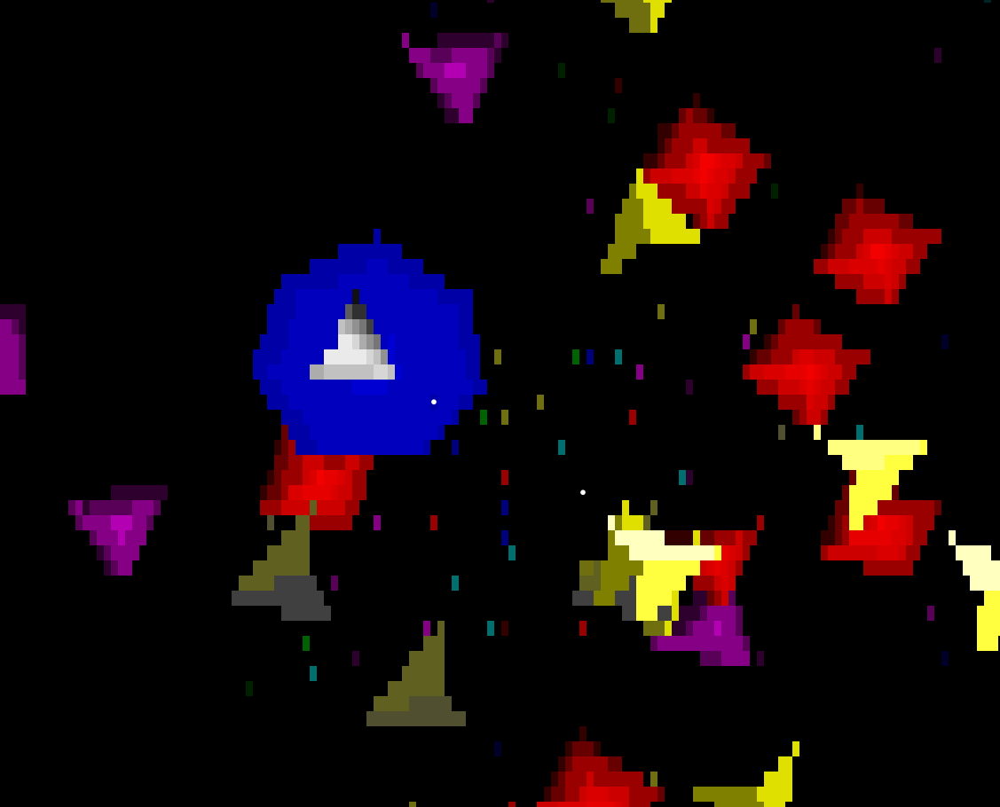

# Asteroids game inside the terminal




### Building

[You will need Rust to compile the binary](https://www.rust-lang.org/tools/install)

```
cargo build --release
```

### Running

```
./target/release/terminoids
```

### Gameplay

Unfortunately terminals don't directly support input like UI apps do.\
What I mean is that KEY_UP & KEY_DOWN events are not supported,\
the way the terminal works is to get a key stroke event and act accordingly.

This means that buttons have to be tapped in order to get a move\
holding a button down will work until another button is pressed\
Remember this works inside the terminal, so like a text editor\
You cannot press two buttons at once, you got to tap them.

Due to this limitation the game work like this:
- Pressing **Fire** button will enable firing, the ship will fire automatically\
  until the **Fire** is pressed again to stop
- Pressing **Left** or **Right** will turn the ship only a slight amount
- Pressing **Up** will propel the ship forward a slight amount


Left - Right  : Rotate ship\
Up            : Move forward\
Space         : Fire\
P             : Pause\
Q or Ctrl-C   : Exit


#### Asteroids

- Huge           : 200pts


- Big            : 150pts


- Medium         : 100pts


- Small          :  75pts


- Tiny           :  50pts


#### Star-ships

- Big cluster    : 250pts


- Medium cluster : 200pts


- Small cluster  : 150pts


- Flying ship    : 100pts


#### Power-ups

- Red            : 1000pts - gives piercing bullets for 5 seconds


- Green          : 1000pts - gives split fire for 7 seconds


- Blue           : 1000pts - gives shield for 10 seconds


- White          : 1000pts - gives rapid fire for 5 seconds


## Self-Promotion

I make video games

[Twitter](http://twitter.com/c64cosmin)

[YouTube](https://www.youtube.com/@c64cosmin)

You can play some free games here\
No download, directly in browser\
Hope you get a high score in the leader board :D

[HomePage](https://stupidrat.com)

## License

Copyright (c) Cosmin MUNTEANU.
