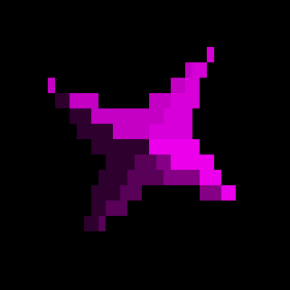

# Asteroids game inside the terminal


### Building

```
cargo build --release
```

### Running

```
./target/release/terminoids
```

### Gameplay

Unfortunately terminals don't directly support input like UI apps do.
What I mean is that KEY_UP & KEY_DOWN events are not supported,
the way the terminal works is to get a key stroke event and act accordingly.

Due to this limitation the game will work by switching on & off movements.
Pressing the movement once to activates it, pressing it again turn it off.


Left - Right  : Rotate ship
Up            : Move forward
Down          : Stop movement
Space         : Fire


#### Asteroids

- Huge           : 200pts


- Big            : 150pts


- Medium         : 100pts


- Small          :  75pts


- Tiny           :  50pts


#### Star-ships

- Big cluster    : 250pts


- Medium cluster : 200pts


- Small cluster  : 150pts



- Flying ship    : 100pts


#### Power-ups

- Red            : 1000pts - gives piercing bullets for 5 seconds


- Green          : 1000pts - gives split fire for 7 seconds


- Blue           : 1000pts - gives shield for 10 seconds


## Self-Promotion

I make video games

[Twitter](http://twitter.com/c64cosmin)

[YouTube](https://www.youtube.com/@c64cosmin)

You can play some free games here\
No download, directly in browser\
Hope you get a high score in the leader board :D

[HomePage](https://stupidrat.com)

## License

Copyright (c) Cosmin MUNTEANU.
